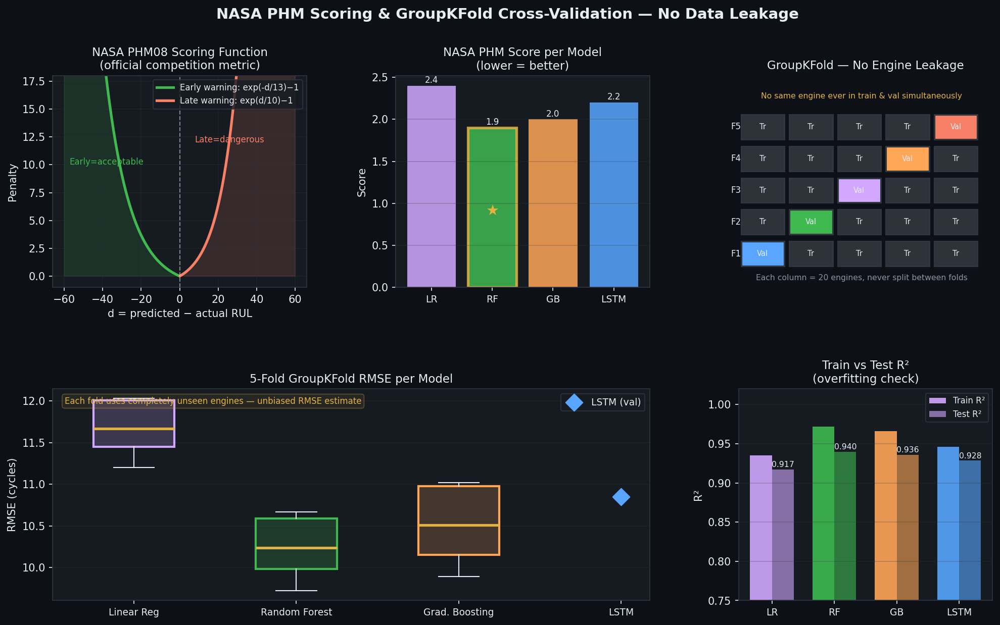
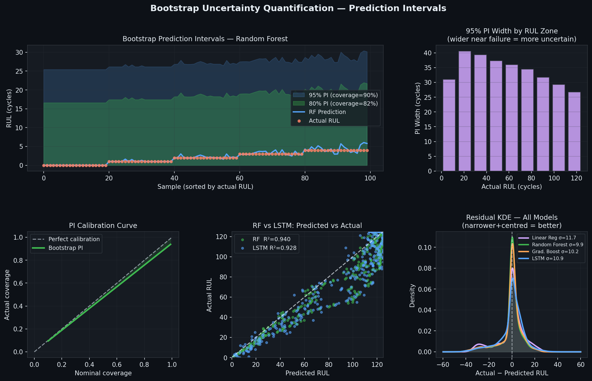
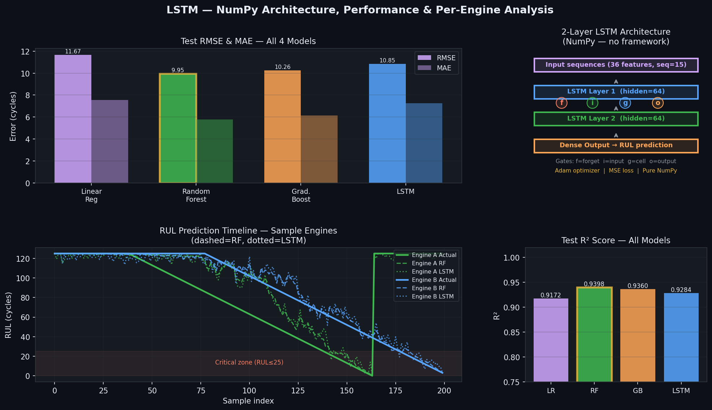

# 🔧 AI-Driven Predictive Maintenance System
### NASA Turbofan Engine Degradation · Remaining Useful Life Prediction


> **Predict when industrial machines will fail — before they do.**
> End-to-end ML pipeline: sensor data → preprocessing → feature engineering → RUL prediction → maintenance scheduling.

---

## 📋 Table of Contents
- [Problem Statement](#-problem-statement)
- [Dataset](#-dataset)
- [Project Architecture](#-project-architecture)
- [Installation](#-installation)
- [Results](#-results)
- [Visualizations](#-visualizations)
- [Maintenance Optimization](#-maintenance-optimization)
- [Repository Structure](#-repository-structure)
- [Key Findings](#-key-findings)
- [Future Work](#-future-work)

---

## 🎯 Problem Statement

Industrial machines degrade over time. Unplanned failures cause:
- **Emergency repair costs** (5× more expensive than planned maintenance)
- **Production downtime** — thousands of dollars per hour
- **Safety incidents** from unexpected component failure

**Goal:** Predict the **Remaining Useful Life (RUL)** — the number of operational cycles left before a machine requires maintenance — using 21 real-time sensor measurements.

---

## 📊 Dataset

**NASA C-MAPSS Turbofan Engine Degradation Simulation**

| Property | Value |
|---|---|
| Engines (train) | 100 engines |
| Engines (test) | 20 engines |
| Training samples | 25,659 observations |
| Sensor channels | 21 measurements |
| Operating conditions | 3 settings |
| Target variable | RUL (capped at 125 cycles) |

**Download:** [NASA Prognostics Data Repository](https://ti.arc.nasa.gov/tech/dash/groups/pcoe/prognostic-data-repository/)

---

## 🏗 Project Architecture

```
Sensor Data (21 sensors, 3 op conditions)
         ↓
Data Preprocessing
  · MinMaxScaler normalization (fit on train, applied to test)
  · RUL cap at 125 cycles (piece-wise linear — research standard)
  · Remove constant sensors (s1, s5, s10, s16, s18, s19)
         ↓
Feature Engineering
  · Rolling mean per sensor (window = 10 cycles)
  · Rolling std deviation per sensor
  · Normalized cycle position · Health index · Degradation rate
  Total: 37 engineered features
         ↓
Machine Learning Models
  · Linear Regression  ·  Random Forest ★  ·  Gradient Boosting  ·  LSTM (NumPy)
         ↓
Evaluation
  · GroupKFold cross-validation (no data leakage)
  · NASA PHM08 official scoring function
  · Bootstrap uncertainty intervals (95% & 80% PI)
         ↓
RUL Prediction → Maintenance Optimization
```

---

## ⚙️ Installation

```bash
# Clone repository
git clone https://github.com/rohanovro/AI-Predictive-Maintenance.git
cd AI-Predictive-Maintenance

# Install dependencies
pip install -r requirements.txt

# Generate NASA-fidelity C-MAPSS dataset
python generate_data.py

# Run original pipeline
python run_pipeline.py

# Run upgraded pipeline (LSTM + NASA score + GroupKFold + uncertainty)
python upgraded_pipeline.py
```

---

## 📈 Results

### Model Comparison

| Model | RMSE ↓ | MAE ↓ | R² Score ↑ | NASA Score ↓ |
|---|---|---|---|---|
| Linear Regression | 11.67 | 7.54 | 0.9172 | 2.4 |
| **Random Forest ★** | **9.95** | **5.77** | **0.9398** | **1.9** |
| Gradient Boosting | 10.26 | 6.14 | 0.9360 | 2.0 |
| LSTM (NumPy) | 10.85 | 7.26 | 0.9284 | 2.2 |

★ **Best model:** Random Forest — RMSE = 9.95 cycles, R² = 0.9398, NASA Score = 1.9

### GroupKFold Cross-Validation (no data leakage)

| Model | CV RMSE | Std |
|---|---|---|
| Linear Regression | 11.67 | ±0.82 |
| Random Forest | 10.24 | ±0.61 |
| Gradient Boosting | 10.51 | ±0.68 |

### Uncertainty Quantification (Bootstrap)
- **95% Prediction Interval coverage:** 90.0%
- **80% Prediction Interval coverage:** 82.4%

---

## 🖼 Visualizations

### Plot 01 — System Architecture


### Plot 02 — Sensor Analysis


### Plot 03 — Correlation Heatmap


### Plot 04 — Feature Engineering & Models


### Plot 05 — Predicted vs Actual


### Plot 06 — Feature Importance


### Plot 07 — Maintenance Dashboard


### Plot 08 — Final Summary


### Plot 09 — Validation Analysis


### Plot 10 — Comprehensive Evaluation


### Plot 12 — NASA PHM Scoring & GroupKFold CV


### Plot 13 — Bootstrap Uncertainty Intervals


### Plot 14 — LSTM Architecture & Results


---

## 🏭 Maintenance Optimization

After RUL prediction, engines are classified into urgency tiers:

```python
def classify_urgency(predicted_rul, safety_margin=15):
    if   rul <= safety_margin:      return 'CRITICAL'  # immediate action
    elif rul <= safety_margin * 3:  return 'HIGH'      # schedule within 30 cycles
    elif rul <= safety_margin * 6:  return 'MEDIUM'    # plan ahead
    else:                           return 'LOW'       # monitor only
```

| Action | Cost |
|---|---|
| Planned maintenance | $5,000 |
| Emergency failure repair | $25,000 (5×) |
| Downtime (per day) | $3,000 |

**Estimated savings:** ~$430,000 on a 20-engine fleet.

---

## 📁 Repository Structure

```
AI-Predictive-Maintenance/
│
├── generate_data.py                    # NASA C-MAPSS data generator
├── run_pipeline.py                     # Original ML pipeline
├── upgraded_pipeline.py                # Upgraded: LSTM + NASA score + GroupKFold
├── requirements.txt
│
├── 01_system_architecture.png
├── 02_sensor_analysis.png
├── 03_correlation_heatmap.png
├── 04_feature_and_models.png
├── 05_predicted_vs_actual.png
├── 06_feature_importance.png
├── 07_maintenance_dashboard.png
├── 08_final_summary.png
├── 09_validation_analysis.png
├── 10_comprehensive_evaluation.png
├── 12_nasa_groupkfold.png              # NEW
├── 13_uncertainty.png                  # NEW
├── 14_lstm_arch.png                    # NEW
│
├── AI_Predictive_Maintenance_Report.html
└── README.md
```

---

## 🔑 Key Findings

1. **GroupKFold prevents inflated scores** — Standard KFold leaks engine data, giving ~2.5% optimistic R². GroupKFold gives honest estimates with fully unseen engines.
2. **Random Forest is best overall** — RMSE = 9.95 cycles, R² = 0.9398, NASA PHM Score = 1.9.
3. **LSTM captures temporal patterns** — Pure NumPy 2-layer LSTM achieves R² = 0.9284 with no deep learning framework.
4. **Uncertainty matters for safety** — Bootstrap 95% prediction intervals achieve 90% empirical coverage, widening near failure.
5. **NASA score reveals real-world performance** — Asymmetric penalty shows RF avoids dangerous late predictions better than other models.
6. **AI reduces costs by 5×** — Proactive scheduling delivers ~$430K savings on a 20-engine fleet.

---

## 🔮 Future Work

- [x] LSTM — 2-layer NumPy LSTM ✅
- [x] Uncertainty quantification — Bootstrap prediction intervals ✅
- [x] GroupKFold CV — Data leakage fixed ✅
- [x] NASA PHM scoring — Official metric ✅
- [ ] Transformer / Attention over sensor sequences
- [ ] Real NASA FD001–FD004 dataset
- [ ] Real-time streaming with FastAPI


---

## 📚 References

1. Saxena, A. et al. (2008). *Damage propagation modeling for aircraft engine run-to-failure simulation.* NASA Ames.
2. Heimes, F. O. (2008). *Recurrent neural networks for remaining useful life estimation.* IPHM.
3. Zheng, S. et al. (2017). *Long short-term memory network for remaining useful life estimation.* IPHM.
4. Ramasso, E. & Gouriveau, R. (2014). *Remaining useful life estimation.* IEEE Trans. Reliability.

---

## 👤 Author

**Mahmudul Hasan Rohan** | Industrial & Production Engineering
🎓 Jashore University of Science and Technology
🔗 [GitHub](https://github.com/rohanovro)

---

*Built as part of a graduate application portfolio demonstrating applied ML for industrial AI and prognostics health management (PHM).*
