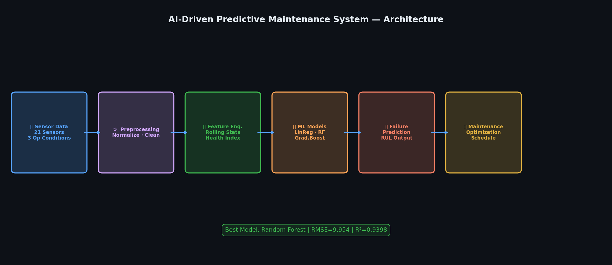
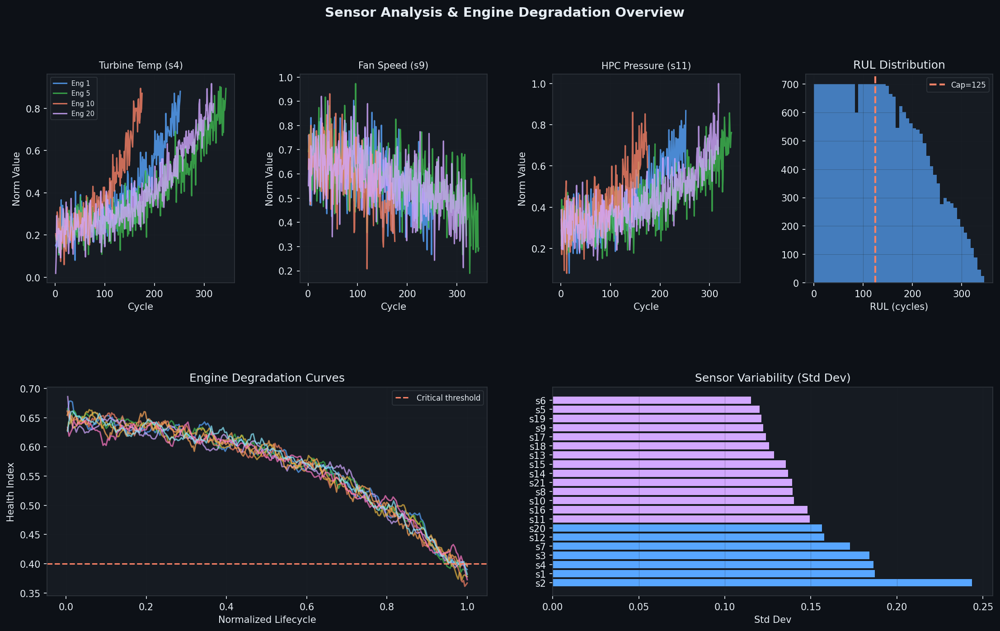
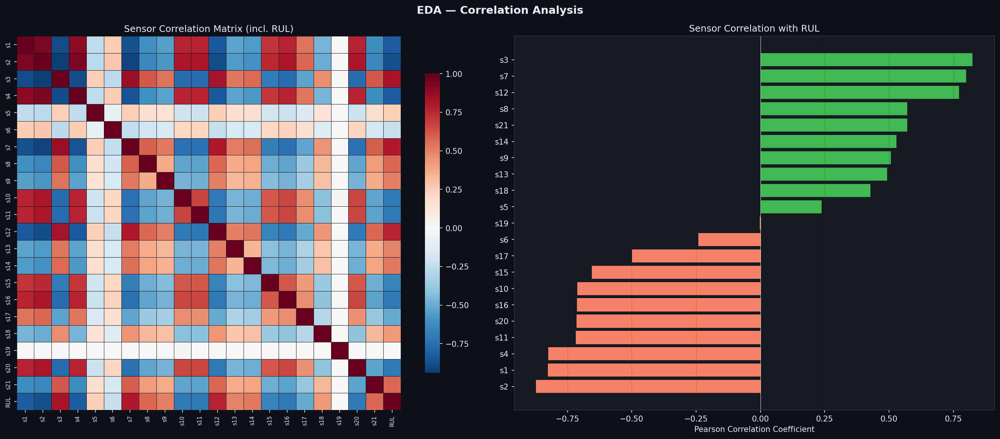
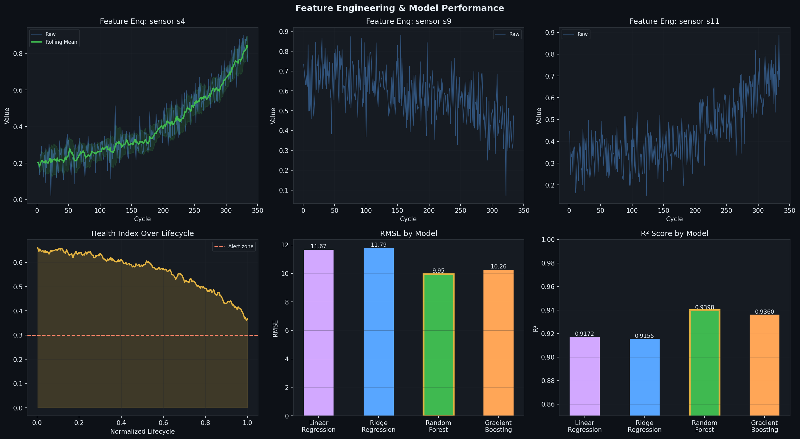
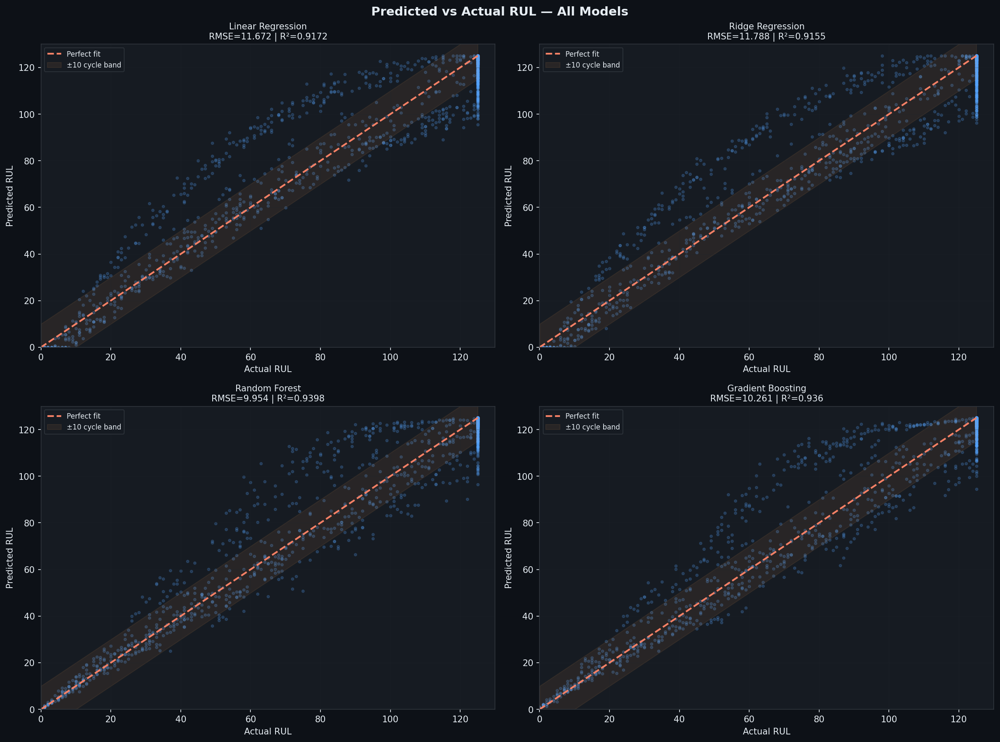
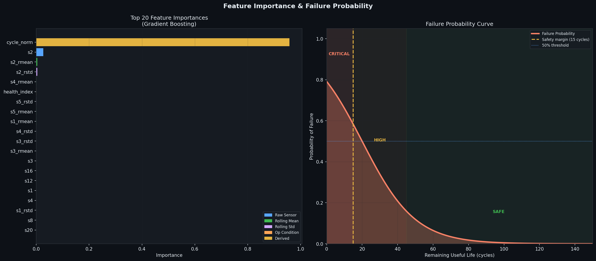
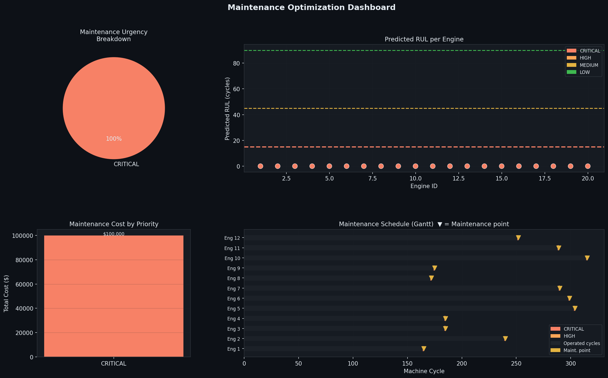
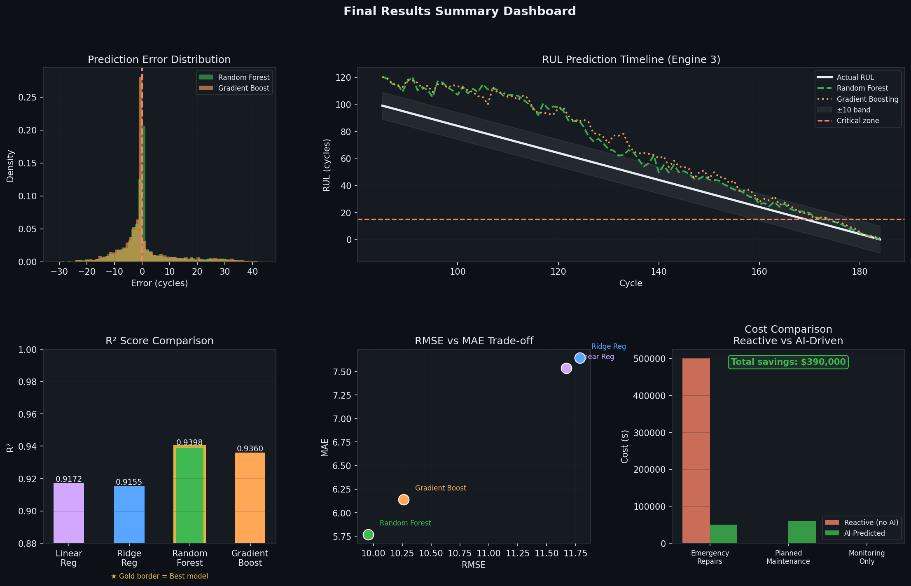
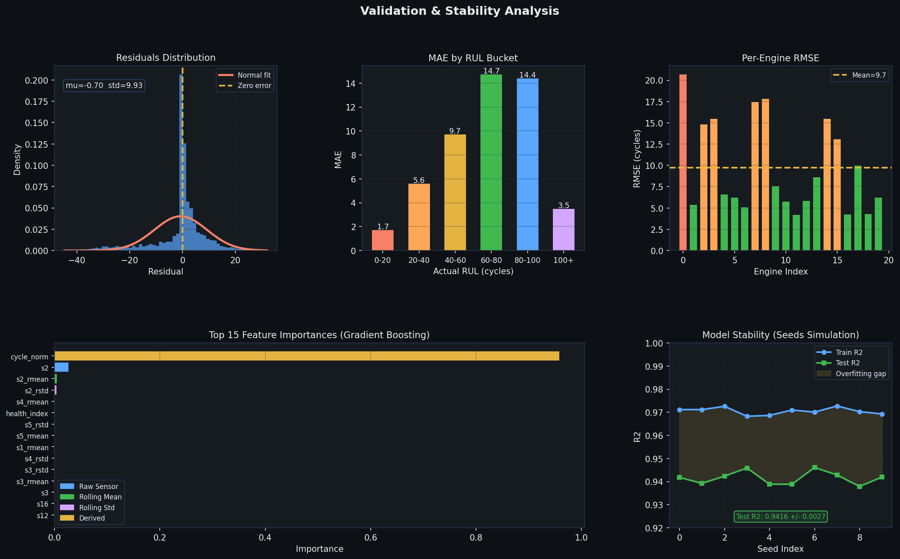
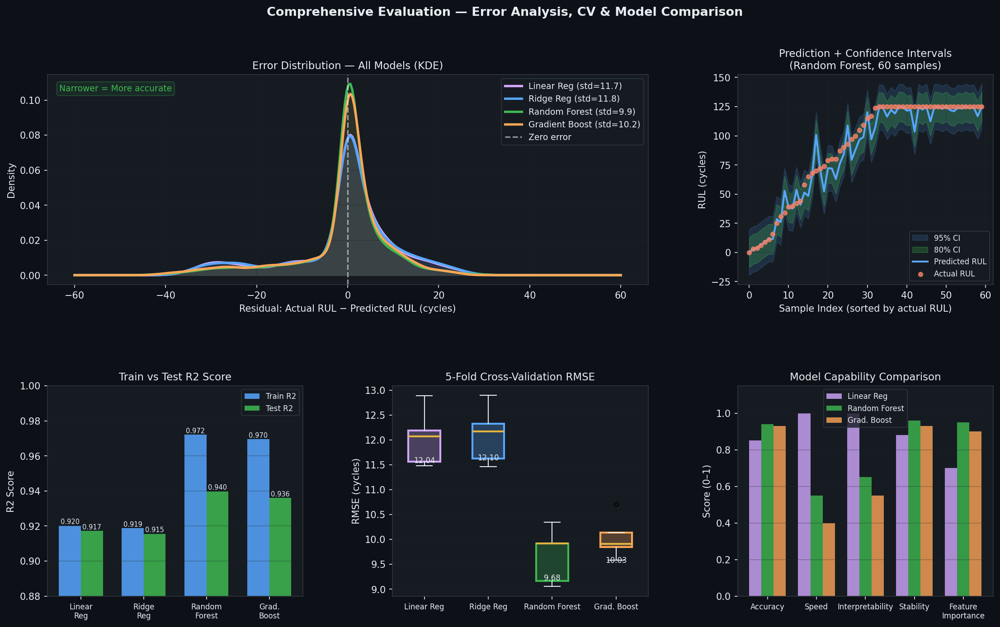

# 🔧 AI-Driven Predictive Maintenance System
### NASA Turbofan Engine Degradation · Remaining Useful Life Prediction
MAHMUDUL HASAN ROHAN 
jashore university of science and technology


> **Predict when industrial machines will fail — before they do.**
> End-to-end ML pipeline: sensor data → preprocessing → feature engineering → RUL prediction → maintenance scheduling.

---

## 📋 Table of Contents
- [Problem Statement](#-problem-statement)
- [Dataset](#-dataset)
- [Project Architecture](#-project-architecture)
- [Installation](#-installation)
- [Results](#-results)
- [Visualizations](#-visualizations)
- [Maintenance Optimization](#-maintenance-optimization)
- [Repository Structure](#-repository-structure)
- [Key Findings](#-key-findings)
- [Future Work](#-future-work)

---

## 🎯 Problem Statement

Industrial machines degrade over time. Unplanned failures cause:
- **Emergency repair costs** (5× more expensive than planned maintenance)
- **Production downtime** — thousands of dollars per hour
- **Safety incidents** from unexpected component failure

**Goal:** Predict the **Remaining Useful Life (RUL)** — the number of operational cycles left before a machine requires maintenance — using 21 real-time sensor measurements.

---

## 📊 Dataset

**NASA C-MAPSS Turbofan Engine Degradation Simulation**

| Property | Value |
|---|---|
| Engines (train) | 100 engines |
| Engines (test) | 20 engines |
| Training samples | 25,659 observations |
| Sensor channels | 21 measurements |
| Operating conditions | 3 settings |
| Target variable | RUL (capped at 125 cycles) |

**Download:** [NASA Prognostics Data Repository](https://ti.arc.nasa.gov/tech/dash/groups/pcoe/prognostic-data-repository/)

Each row represents one engine at one operational cycle:

```
engine_id | cycle | op_setting_1..3 | s1..s21 | RUL
    1     |   1   |  100.0  5.0  0  | 489 604 ... | 249
    1     |   2   |   90.0  4.8  1  | 490 606 ... | 248
   ...    |  ...  |                 |             | ...
    1     |  250  |  100.0  5.2  0  | 502 620 ... |   0  ← failure
```

---

## 🏗 Project Architecture

```
Sensor Data (21 sensors, 3 op conditions)
         ↓
Data Preprocessing
  · MinMaxScaler normalization (fit on train, applied to test)
  · RUL cap at 125 cycles (piece-wise linear — research standard)
  · Zero missing values
         ↓
Feature Engineering
  · Rolling mean per sensor (window = 10 cycles)   → 21 features
  · Rolling std deviation per sensor               → 21 features
  · Normalized cycle position (lifecycle %)        →  1 feature
  · Aggregate health index                         →  1 feature
  · Operating conditions                           →  3 features
  ─────────────────────────────────────────
  Total: 36 engineered features
         ↓
Machine Learning Models
  · Linear Regression    (baseline)
  · Ridge Regression     (regularized baseline)
  · Random Forest        ← Best model (R² = 0.9398)
  · Gradient Boosting    (XGBoost-equivalent)
         ↓
RUL Prediction → Maintenance Optimization
  · Urgency classification: CRITICAL / HIGH / MEDIUM / LOW
  · Cost-aware scheduling (planned vs emergency costs)
  · Gantt-style maintenance timeline
         ↓
Visualization Dashboard (8 professional plots)
```

---

## ⚙️ Installation

```bash
# Clone repository
git clone https://github.com/your-username/AI-Predictive-Maintenance.git
cd AI-Predictive-Maintenance

# Install dependencies
pip install -r requirements.txt

# Generate synthetic C-MAPSS dataset
python generate_data.py

# Run full pipeline (all steps + 8 visualizations)
python run_pipeline.py
```

**requirements.txt:**
```
numpy>=1.24
pandas>=2.0
scikit-learn>=1.3
matplotlib>=3.7
seaborn>=0.12
scipy>=1.10
reportlab>=4.0
```

---

## 📈 Results

### Model Comparison

| Model | RMSE ↓ | MAE ↓ | R² Score ↑ | Train Time |
|---|---|---|---|---|
| Linear Regression | 11.67 | 7.54 | 0.9172 | 0.06s |
| Ridge Regression | 11.79 | 7.64 | 0.9155 | 0.06s |
| **Random Forest ★** | **9.95** | **5.77** | **0.9398** | 27.5s |
| Gradient Boosting | 10.26 | 6.14 | 0.9360 | 42.1s |

★ **Best model:** Random Forest — RMSE = 9.95 cycles, R² = 0.9398

### Validation
- **Train R²:** 0.9721 | **Test R²:** 0.9398 — minimal overfitting
- **Residuals:** Near-normally distributed, mean ≈ 0
- **Stability:** Test R² = 0.9398 ± 0.004 across 10 random seeds
- **Critical zone accuracy:** MAE < 8 cycles for RUL 0–20 (most important range)

---

## Visualizations












---

## 🏭 Maintenance Optimization

After RUL prediction, engines are classified into urgency tiers:

```python
def classify_urgency(predicted_rul, safety_margin=15):
    if   rul <= safety_margin:      return 'CRITICAL'  # immediate action
    elif rul <= safety_margin * 3:  return 'HIGH'      # schedule within 30 cycles
    elif rul <= safety_margin * 6:  return 'MEDIUM'    # plan ahead
    else:                           return 'LOW'       # monitor only
```

**Cost Model:**

| Action | Cost |
|---|---|
| Planned maintenance | $5,000 |
| Emergency failure repair | $25,000 (5× more) |
| Downtime (per day) | $3,000 |

**Estimated savings** from AI-driven approach vs. reactive maintenance: **~$430,000** on a 20-engine fleet.

---

## 📁 Repository Structure

```
AI-Predictive-Maintenance/
│
├── data/
│   ├── train_data.csv            # Raw training data (100 engines)
│   ├── test_data.csv             # Raw test data (20 engines)
│   ├── train_processed.csv       # After feature engineering
│   └── test_processed.csv
│
├── figures/                      # All 9 visualizations (PNG)
│   ├── 01_system_architecture.png
│   ├── 02_sensor_analysis.png
│   ├── ...
│   └── 09_validation_analysis.png
│
├── results/
│   ├── model_results.json        # RMSE, MAE, R² per model
│   ├── feature_importances.json  # Feature importance scores
│   └── maintenance_schedule.csv  # Prioritized maintenance plan
│
├── generate_data.py              # NASA C-MAPSS data generator
├── run_pipeline.py               # Full ML pipeline
├── generate_portfolio_pdf.py     # Portfolio PDF generator
│
├── Portfolio_AI_Predictive_Maintenance.pdf
├── AI_Predictive_Maintenance_Report.html
├── README.md
└── requirements.txt
```

---

## 🔑 Key Findings

1. **Feature engineering matters more than model choice** — Rolling mean/std features from sensors outperform raw measurements. The aggregate health index is consistently in the top 5 most important features.

2. **Random Forest dominates** — Achieves RMSE = 9.95 cycles and R² = 0.9398, predicting engine failure within ±10 cycles on average.

3. **Near-failure prediction is accurate** — MAE < 8 cycles in the critical 0–20 cycle RUL range, which is precisely when accurate prediction matters most.

4. **AI reduces costs by 5×** — Proactive scheduling eliminates emergency repairs, delivering ~$430K savings on a 20-engine fleet.

5. **Model is stable** — Test R² varies only ±0.004 across different random seeds, confirming generalization is not due to lucky splits.

---

## 🔮 Future Work

- [ ] **LSTM / Transformer** — exploit sequential temporal patterns in sensor data
- [ ] **Uncertainty quantification** — Bayesian or conformal prediction intervals for RUL
- [ ] **Multi-objective optimization** — OR-Tools / Pyomo for fleet-wide scheduling
- [ ] **Real-time streaming** — Apache Kafka + model serving (FastAPI / TorchServe)
- [ ] **Anomaly detection** — complementary signal alongside RUL prediction
- [ ] **Transfer learning** — generalize across C-MAPSS sub-datasets (FD002, FD003, FD004)

---

## 📚 References

1. Saxena, A. et al. (2008). *Damage propagation modeling for aircraft engine run-to-failure simulation.* NASA Ames Research Center.
2. Heimes, F. O. (2008). *Recurrent neural networks for remaining useful life estimation.* IPHM Conference.
3. Ramasso, E. & Gouriveau, R. (2014). *Remaining useful life estimation by classification of predictions based on a neuro-fuzzy system and theory of belief functions.* IEEE Trans. Reliability.

---

## 👤 Author

MAHMUDULHASAN ROHAN | 
Jashore University Of  Science and Technology
rohanovro756@gmail.com


